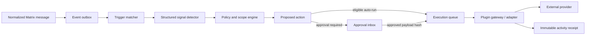

# Claire Plugin System Specification

## 1. Product summary

Claire Plugins connect conversation context to external services. A plugin may supply read-only context, expose typed actions, or participate in user-configured automations. The first flagship flow is Calendar: when a conversation reaches a clear agreement on a date and time, Claire prepares an event and asks the user to review it.

The system is not an unrestricted extension runtime. Plugins are declarative packages executed through a Claire-controlled gateway. The gateway validates every input, enforces account and conversation scopes, requests approval where required, redacts data, executes the action, and records an immutable receipt.

The product has five surfaces:

1. **Library** — discover verified, community, and private workspace plugins.
2. **Plugin detail** — understand capabilities, publisher, data handling, permissions, and pricing before installation.
3. **Automation builder** — configure trigger, conversation scope, action, destination, and approval policy.
4. **Approval inbox** — review the exact action and data before a sensitive write.
5. **Activity** — inspect, retry, undo, disable, or revoke every action.

The UI reference is [plugin-mockups.html](../landing/plugin-mockups.html).

## 2. Product principles

- **Detection is not permission.** Finding a date in a message never authorizes an event creation.
- **Account access and conversation access are separate grants.** Connecting Google Calendar does not expose every Claire chat to Calendar.
- **Minimum context by default.** Send structured fields derived by Claire when possible, not raw transcripts.
- **Sensitive writes require review.** Invites, outbound messages, payments, deletions, and public publishing always require approval in v1.
- **No silent privilege expansion.** New manifest scopes or materially changed behavior pause the plugin until reapproved.
- **Every action has provenance.** Store the initiating event, relevant source messages, actor, inputs, result, and approval.
- **Automation must remain reversible.** Users can disable a rule, disconnect an account, revoke credentials, and undo an action when the provider supports it.
- **Self-hosting remains real.** Community deployments can use local/private plugins without routing message content through Claire Cloud.

## 3. Initial catalog and delivery order

### First-party launch plugins

| Plugin    | Context                 | Actions                   | Default approval                                    |
| --------- | ----------------------- | ------------------------- | --------------------------------------------------- |
| Calendar  | Free/busy, calendars    | Draft/create/update event | Ask for create/update                               |
| Tasks     | Projects, assignees     | Create/complete task      | Ask for create; optional auto-run for private tasks |
| Notes     | Pages/databases         | Save decision or summary  | Ask for shared destinations                         |
| Reminders | None                    | Create personal reminder  | Optional auto-run                                   |
| Contacts  | Existing contact fields | Propose contact update    | Ask every time                                      |

Calendar adapters should initially support Google Calendar, Microsoft Outlook, and CalDAV behind one Claire capability model.

### Wave 2

- HubSpot and Salesforce: log conversation, create follow-up, update deal note.
- Google Drive, Dropbox, and Notion search: retrieve user-selected knowledge and share a link.
- Slack and Teams: prepare a message or summary; sending always requires approval.
- GitHub and Linear: create issue, add comment, or associate a conversation source.
- Webhooks: outbound signed POST for advanced self-hosters; disabled in Claire Cloud until abuse controls exist.

### Explicit v1 exclusions

- Arbitrary third-party JavaScript running inside the Claire server or client.
- Plugins drawing unrestricted custom UI inside a message thread.
- Background outbound messaging without review.
- Payments, purchases, account deletion, or destructive administration.
- Marketplace payments or revenue share. The catalog may show free/private plugins first.

## 4. Plugin package contract

Each plugin is versioned and identified by an immutable reverse-domain ID. The signed manifest is stored in the registry and snapshotted into every installation.

```ts
type ClairePluginManifest = {
  schemaVersion: '1';
  id: string; // e.g. com.claire.calendar
  version: string; // semver
  name: string;
  description: string;
  publisher: {
    id: string;
    name: string;
    verification: 'claire' | 'verified' | 'community' | 'private';
    website: string;
    privacyPolicyUrl: string;
    supportUrl: string;
  };
  icon: { lightUrl: string; darkUrl?: string; sha256: string };
  runtime: {
    kind: 'claire_adapter' | 'remote_mcp' | 'private_mcp';
    endpointRef?: string;
    minimumClaireVersion?: string;
  };
  auth: Array<{
    id: string;
    type: 'oauth2' | 'api_key' | 'none';
    provider: string;
    requestedScopes: string[];
  }>;
  capabilities: Array<{
    id: string;
    kind: 'context' | 'action';
    title: string;
    description: string;
    inputSchema: JsonSchema;
    outputSchema: JsonSchema;
    risk: 'read' | 'low_write' | 'external_write' | 'destructive';
    approval: 'never' | 'configurable' | 'always';
    reversible: boolean;
    idempotency: boolean;
  }>;
  triggers: Array<{
    id: string;
    event:
      | 'message.received'
      | 'message.sent'
      | 'promise.detected'
      | 'schedule.detected'
      | 'manual';
    supportedActions: string[];
  }>;
  dataHandling: {
    receivesRawMessages: boolean;
    retention: 'none' | 'transient' | 'provider_policy';
    regions?: string[];
  };
};
```

Manifests are data, not executable code. JSON schemas are compiled and cached by the server. Unknown fields are rejected. The registry rejects mutable asset URLs without a content hash.

### Runtime types

- `claire_adapter`: first-party TypeScript adapter deployed with the Bun server and reviewed with Claire code.
- `remote_mcp`: verified HTTPS MCP server, proxied through the plugin gateway. Use OAuth 2.1 with PKCE and resource/audience binding. Never pass provider tokens through to an MCP server that is not their intended audience.
- `private_mcp`: workspace-configured server for self-hosted or enterprise use. It is clearly labeled unverified and disabled from automatic actions until an administrator approves its tools.

Vercel AI SDK tools may be the internal model-facing adapter because they provide typed schemas and tool approval primitives. The durable Claire approval record—not an in-memory model loop—remains authoritative. MCP is best used for private/user-supplied tools; first-party production plugins should use controlled Claire adapters for type, latency, version, and security guarantees.

## 5. Permissions and approval model

### Independent permission dimensions

An installation is not active until all applicable dimensions are chosen:

1. **External account** — provider account and OAuth scopes.
2. **Claire context** — no messages, current chat, selected people/chats, or workspace-wide metadata. Workspace-wide raw-message access is unavailable in v1.
3. **Capability** — individual actions, such as `calendar.events.create`, not a single plugin-wide switch.
4. **Execution policy** — manual only, suggest, ask every time, or auto-run where eligible.
5. **Destination** — specific calendar, project, database, team, or repository.

### Approval rules

| Risk           | Examples                                            | v1 policy                                                                     |
| -------------- | --------------------------------------------------- | ----------------------------------------------------------------------------- |
| Read           | Free/busy, selected file search                     | Explicit install/scope consent; no per-call approval unless sensitive         |
| Low write      | Private reminder, private task                      | Ask by default; user may enable auto-run per automation                       |
| External write | Invite guest, send message, shared note, CRM update | Always ask                                                                    |
| Destructive    | Delete event, close account, delete external data   | Always ask plus destructive confirmation; generally unavailable to automation |

The approval UI shows plugin, external account, action, destination, exact structured payload, source messages, data leaving Claire, and whether an undo is available. Approval is bound to a hash of that payload. Any post-approval mutation invalidates it.

## 6. Conversation trigger pipeline



1. Message ingestion completes normally and writes a transactional outbox event. Plugin processing must never block Matrix ingestion.
2. The matcher loads enabled automations for that user and event type, then enforces conversation scope before inference.
3. A deterministic/AI detector emits a typed signal such as `schedule.detected` with confidence, participants, time zone evidence, and message references.
4. The policy engine rejects ambiguity, duplicate actions, missing permissions, expired credentials, and unsupported risk policies.
5. Claire stores a proposed action with a normalized payload and idempotency key. Raw message content is excluded unless the target capability explicitly requires it.
6. The user approves, edits, rejects, or ignores the proposal. Editing produces a new payload hash.
7. A worker leases the action, resolves the credential reference, executes through an adapter, and writes the receipt. Retries use the same idempotency key.

### Calendar detection requirements

The detector must distinguish proposal from agreement. “How about Tuesday?” does not trigger; “Tuesday at 10 works—see you then” can trigger. It must resolve participants, locale, time zone, duration, and calendar destination. Missing time zone or conflicting times produce a draft requiring correction, never a guessed auto-run.

Deduplicate by automation, chat, participant set, normalized start time, and source-message window. Edits or cancellations in later messages may propose an update to the original event by stored external object ID.

## 7. Data model

Add the following workspace/user-owned tables with RLS:

- `plugin_registry_entries`: signed manifest, review status, current version, publisher.
- `plugin_installations`: user/workspace, plugin/version snapshot, status, installed_by, configuration.
- `plugin_accounts`: installation, provider, display metadata, credential reference, granted scopes, health. No tokens in Supabase rows.
- `plugin_context_grants`: installation, scope type, selected chat/contact IDs, expiration.
- `plugin_capability_grants`: capability, approval policy, destination constraints.
- `plugin_automations`: trigger, detector config, capability/action, enabled state, version.
- `plugin_action_proposals`: source event/message refs, structured input, confidence, payload hash, status, expiry.
- `plugin_approvals`: proposal, actor, decision, payload hash, device, timestamp.
- `plugin_executions`: proposal/manual invocation, idempotency key, lease, attempts, result/error class, external object reference.
- `plugin_activity_receipts`: append-only user-facing record with redacted inputs/result and undo metadata.
- `plugin_event_outbox`: durable ingestion events and processing cursor.

Credential values live in the existing future encrypted secret store for Cloud and Keychain/Docker secrets for local deployments. Tables store opaque references only. Activity rows must never contain access tokens, authorization codes, cookies, raw provider errors, or entire conversation transcripts.

## 8. Service architecture

Add a `server/src/plugins/` boundary containing:

- `registry/`: manifest validation, signatures, version compatibility, publisher trust.
- `gateway/`: normalized capability invocation, timeout, egress allowlist, response size limits.
- `adapters/`: first-party Calendar/Tasks/Notes providers.
- `triggers/`: outbox consumers and signal detectors.
- `policy/`: context grants, capability grants, risk classification, approval enforcement.
- `workers/`: proposal, execution, retry, credential-health, and undo queues.
- `audit/`: redaction and append-only receipt creation.

Reuse Redis-backed queues if the current message queue infrastructure proves durable enough; otherwise use Postgres leasing (`FOR UPDATE SKIP LOCKED`) so self-hosted deployments do not require another service. In either case, the database is the state authority and Redis is not the only copy of a proposal or execution.

All model tool calls pass through `PluginPolicyEngine.authorize()`. The model can propose an action but cannot call an adapter directly. Tool descriptions and remote MCP metadata are untrusted inputs and never override the manifest risk classification.

## 9. API surface

All endpoints require the existing authenticated user context and enforce RLS-equivalent ownership in server code.

```text
GET    /api/plugins
GET    /api/plugins/:pluginId
POST   /api/plugins/:pluginId/install
PATCH  /api/plugin-installations/:id
DELETE /api/plugin-installations/:id

POST   /api/plugin-installations/:id/accounts/authorize
GET    /api/plugin-oauth/callback/:provider
DELETE /api/plugin-accounts/:id

GET    /api/plugin-automations
POST   /api/plugin-automations
PATCH  /api/plugin-automations/:id
POST   /api/plugin-automations/:id/test
DELETE /api/plugin-automations/:id

GET    /api/plugin-actions?status=pending
GET    /api/plugin-actions/:id
POST   /api/plugin-actions/:id/approve
POST   /api/plugin-actions/:id/reject
POST   /api/plugin-actions/:id/retry
POST   /api/plugin-actions/:id/undo

GET    /api/plugin-activity
GET    /api/plugin-activity/export
```

OAuth start responses return an authorization URL and signed, short-lived state. Mobile uses an HTTPS universal link callback; desktop uses an HTTPS or loopback callback with PKCE. The server validates exact redirects, issuer, state, nonce where applicable, token audience, and scopes before persisting a credential reference.

Realtime publishes proposal status and activity receipt changes to the user. The clients never receive provider refresh tokens.

## 10. Client behavior

### Shared navigation

Plugins live under Settings/More in the mobile app and as a standard destination in the expanded desktop rail. Do not add a sixth primary mobile tab. Contextual proposals appear inside chat as Claire cards and in Home under “Needs your approval.”

### Required screens

- Library with categories, search, installed filter, publisher trust, and hosting compatibility.
- Plugin detail with capabilities, screenshots/example flow, data handling, permissions, and version history.
- Install wizard: account → conversation scope → capabilities → default approval → confirmation.
- Automation list and builder.
- Approval detail with editable payload and source evidence.
- Activity, execution receipt, failure recovery, and undo.
- Connected account health and reauthentication.
- Plugin settings, disable, uninstall, delete plugin data, and revoke account.

Desktop provides the full automation builder. Mobile v1 supports enabling templates and editing scope/destination/approval; complex conditional rules open a simplified sequence rather than a canvas.

## 11. Failure, privacy, and abuse controls

- Credentials expire: pause affected automations, surface reauthentication, and retain proposals without retry storms.
- Provider outage/rate limit: exponential backoff with jitter; show delayed state; never duplicate a write.
- Plugin timeout or malformed response: quarantine repeated failures and preserve a redacted diagnostic ID.
- Scope removed: immediately block new proposals and executions; do not rely on cached grants.
- Plugin update: compare manifest permissions. Additive scopes or higher risk require explicit reapproval.
- Uninstall: stop triggers first, revoke provider credentials where supported, remove secrets, and retain minimal receipts according to policy.
- Prompt injection: external message text and MCP tool descriptions cannot change policies, grant scopes, choose hidden destinations, or bypass approval.
- Data exfiltration: egress allowlist per plugin, request/response byte caps, structured payloads, log redaction, and anomaly rate limits.
- Abuse: quotas per user/plugin/action, publisher suspension, kill switch, manifest revocation list, and Cloud-wide emergency disable.

Private desktop-only mode must run registry, policy, detector, queue, adapters, secrets, and audit locally. A remote plugin receives only the fields shown in its approval/data disclosure. The UI must not claim local-only privacy for remote MCP servers or SaaS providers.

## 12. Developer and publishing model

Phase one supports first-party plugins and private workspace plugins. A public community marketplace begins only after signing, review, abuse response, and upgrade/revocation mechanisms exist.

Developer tooling should include:

- Manifest JSON Schema and TypeScript types.
- Local adapter/MCP connection inspector.
- Synthetic conversation fixtures with no production data.
- Schema validation and approval-policy simulator.
- Egress and redaction report.
- Contract test kit for idempotency, timeout, retry, and undo.
- Package signing and publisher identity verification.

Review checks permissions against actual network behavior, requires a privacy policy, tests account deletion/revocation, and rejects misleading capability descriptions. Verified status describes publisher and review state, not an endorsement or guarantee.

## 13. Observability and product metrics

Operational telemetry contains IDs and classifications, not message bodies or credentials:

- Trigger events evaluated, matched, and rejected by reason.
- Proposal latency and detector confidence distribution.
- Approval, edit, rejection, expiration, and undo rates.
- Execution success, retry, duplicate-prevention, and provider error rates.
- Credential health and reauthentication completion.
- Install-to-first-success and automation disable/uninstall rates.

The primary success metric is **approved useful actions per active plugin installation**, balanced by rejection, undo, and disable rates. Raw invocation count is not a success metric.

## 14. Rollout plan

### Phase 0 — Safety foundation

- Manifest types, risk classifier, policy engine, outbox, proposals, approvals, receipts, and secret references.
- Feature flag all plugin surfaces; no third-party execution.
- Build Calendar adapter contract and fixtures.

### Phase 1 — Calendar manual action

- Install/connect Google Calendar.
- “Add to calendar” from an explicit message selection or Ask Claire result.
- Always-review screen and activity receipt.
- No background detection.

### Phase 2 — Calendar suggestions

- `schedule.detected` pipeline for selected chats.
- Contextual cards, Home approval inbox, deduplication, updates, cancellations, and Outlook/CalDAV.
- Detector shadow mode and precision gate before user-facing suggestions.

### Phase 3 — First-party library

- Tasks, Notes, Reminders, Contacts.
- Automation templates, eligible low-risk auto-run, connected-account health, undo.
- Desktop and mobile parity for core management.

### Phase 4 — Private plugins

- Self-hosted/private MCP registration, explicit admin trust, egress controls, inspector, and contract tests.
- No public discovery.

### Phase 5 — Community marketplace

- Publisher verification, signing, review queue, version reapproval, kill switch, reporting, ratings only after sufficient verified usage, and commercial policy.

## 15. Tests and acceptance criteria

### Contract and security

- Reject invalid/unsigned manifests, unknown scopes, schema drift, and higher-risk updates without reapproval.
- Verify OAuth PKCE, state, issuer, exact redirect, audience binding, token rotation, encryption, revocation, and log redaction.
- Prove a model, detector, client, or MCP server cannot bypass `PluginPolicyEngine`.
- Fuzz capability inputs and remote responses; cap time, redirects, payload size, and allowed hosts.
- Confirm RLS and server ownership checks prevent cross-user installation, proposal, and receipt access.

### Execution

- Idempotent create across retry, worker crash, and duplicate event delivery.
- Approval hash fails after payload mutation or expiration.
- Disconnect/pause blocks queued work before adapter execution.
- Provider 401 pauses the account; 429/5xx retries; permanent 4xx creates an actionable receipt.
- Undo only targets the stored external object and cannot affect a replacement created elsewhere.

### Calendar scenarios

- Confirmed date/time creates one accurate proposal.
- Tentative, joking, quoted, historical, or conflicting dates do not create an action.
- Locale, daylight-saving transition, all-day, recurring, group, and cross-time-zone cases.
- Later reschedule/cancel links to the original event.
- Mac/mobile approval produces the same payload and single execution.

### UX and accessibility

- Library, install, builder, approvals, activity, offline, empty, error, revoked, and update-required states.
- Keyboard navigation, focus order, screen-reader action/data summaries, dynamic type, reduced motion, contrast, and 44px mobile targets.
- Planned/unavailable plugins cannot appear installed or executable.
- Every external write names its destination and data before approval.

### Release gates

- Calendar suggestion precision meets the agreed internal threshold in shadow mode; favor missed suggestions over false actions.
- Zero known paths write externally without the required durable approval.
- No credential or raw conversation content in telemetry, logs, analytics, or crash reports.
- Kill switch and credential revocation are tested in production-like Cloud and self-hosted environments.

## 16. Assumptions and decisions

- “Plugin” is the user-facing term; implementation packages may be first-party adapters or MCP servers.
- Plugins are user/workspace capabilities, while automations are configured trigger-to-action rules built from those capabilities.
- V1 installations are per user. Shared workspace administration and centrally managed grants come later.
- Conversation processing starts after normalized Matrix ingestion and does not change mautrix bridge behavior.
- Calendar is the first vertical slice because its typed fields, reviewable destination, and undo path exercise the complete system.
- Raw messages stay inside Claire unless the capability disclosure and grant explicitly require transmission.
- Claire Cloud and self-hosted deployments expose the same manifest and API contracts; execution location and privacy disclosures differ.

## References

- [Model Context Protocol specification and safety principles](https://modelcontextprotocol.io/specification/2025-03-26/index)
- [MCP authorization](https://modelcontextprotocol.io/specification/2025-11-25/basic/authorization)
- [Vercel AI SDK tool calling and approval](https://ai-sdk.dev/docs/ai-sdk-core/tools-and-tool-calling)
