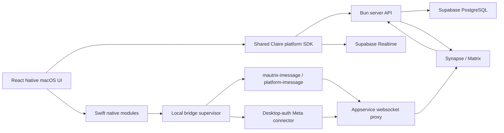

# Claire Desktop implementation specification

Status: design-complete proposal for implementation on a separate functionality branch.

## 1. Product decision

Claire Desktop is a complete messaging client. “Companion” is a capability inside that client, not a separate reduced product.

The app supports two simultaneous modes:

- **Standalone:** sign in, connect supported networks, read and send messages, search, manage promises and relationships, and configure Claire without a mobile device.
- **Companion:** continue drafts and searches from mobile, host Mac-only/on-device bridges, surface bridge health, and hand work between devices.

The visual reference is [`landing/desktop-mockups.html`](../landing/desktop-mockups.html).

## 2. Current technical constraint

The existing Expo client uses React Native `0.83.4`. As of August 2026, the published `react-native-macos` package is `0.81.9`, and Microsoft requires React Native and React Native macOS to use the same minor version. Expo-module support on macOS is also documented as experimental.

Do **not** add `react-native-macos` directly to `client/` until a compatibility spike proves a matching 0.83 release. Start with a separate `desktop/` application pinned to a supported React Native / React Native macOS pair and share product code through packages.

Primary references:

- [React Native macOS introduction](https://microsoft.github.io/react-native-macos/docs/intro)
- [React Native macOS setup and version matching](https://microsoft.github.io/react-native-macos/docs/getting-started)
- [React Native macOS versioning](https://microsoft.github.io/react-native-macos/docs/category/contributing)
- [Experimental Expo module integration](https://microsoft.github.io/react-native-macos/docs/guides/installing-expo-modules)

## 3. Proposed repository topology

```text
claire/
├── client/                         # existing Expo iOS/Android application
├── desktop/                        # React Native macOS application
│   ├── macos/                      # Xcode project, entitlements, native modules
│   ├── src/
│   │   ├── app/                    # desktop navigation and window composition
│   │   ├── screens/
│   │   ├── components/
│   │   ├── native/                 # typed JS facade for Swift modules
│   │   └── bridge-host/            # lifecycle/status UI for local bridges
│   ├── index.js
│   ├── metro.config.js
│   └── package.json
├── packages/
│   ├── design-system/              # semantic tokens and native primitives
│   ├── domain/                     # messages, chats, contacts, promises, search types
│   ├── platform-sdk/               # server API, Supabase, Matrix identifiers
│   └── state/                      # framework-neutral stores and query keys
├── server/
└── docker/
```

The first implementation PR should introduce only `desktop/` plus packages that can be extracted without changing mobile behavior. Move existing mobile code into shared packages incrementally, not as a prerequisite for the desktop shell.

## 4. Desktop information architecture

### Persistent navigation

| Destination | Purpose                                | Default shortcut   |
| ----------- | -------------------------------------- | ------------------ |
| Home        | Daily brief, handoff, bridge health    | `⌘1`               |
| Inbox       | Unified conversations and filters      | `⌘2`               |
| Promises    | Open, waiting, overdue, completed      | `⌘3`               |
| People      | Contacts and relationship memory       | `⌘4`               |
| Search      | Global semantic search                 | `⌘K`               |
| Connections | Network accounts and bridge health     | `⌘,` then Accounts |
| Settings    | AI, notifications, appearance, privacy | `⌘,`               |

### Window model

- Default minimum: `1,024 × 680` points.
- Preferred: `1,280 × 800` points.
- Wide layout: navigation rail + conversation list + content + inspector.
- Medium layout: inspector collapses first.
- Narrow layout: conversation list becomes a back-stack destination.
- Compact chat: independent resizable window, minimum `360 × 460`.
- Persist pane widths and window placement per device.

### Required screens and states

1. Account sign-in and device verification.
2. Desktop home / daily brief / handoff.
3. Unified inbox.
4. Chat with inline AI context and promise detection.
5. AI copilot sheet/popover.
6. Global command search and cited results.
7. Promise tracker.
8. People list and relationship memory editor.
9. Connections overview.
10. Per-network setup flows.
11. iMessage permission wizard.
12. Bridge health and reconnect diagnostics.
13. Settings: AI, notifications, appearance, shortcuts, privacy, updates.
14. Compact chat.
15. Empty, loading, offline, auth-expired, partial-sync, send-failed, and AI-unavailable states.

## 5. Application architecture



### UI and state layers

- **Server state:** TanStack Query for chats, messages, people, promises, connections, and search results.
- **Realtime:** one authenticated subscription coordinator that invalidates query keys; do not let each screen create independent subscriptions.
- **Local UI state:** Zustand for pane state, filters, draft selection, window state, and command palette.
- **Durable local state:** macOS preferences for window and appearance settings; Keychain for device tokens and local bridge secrets.
- **Drafts:** server-backed with optimistic local persistence so mobile/desktop handoff is reliable.

### Shared domain contracts

Extract these first from existing client/server types:

- `Platform`, `PlatformStatus`, `AuthMethod`, and platform capabilities.
- `UnifiedMessage`, `Conversation`, `Contact`, `Promise`, and `SearchResult`.
- Query keys and API response schemas.
- Date/message formatting and urgency utilities.

No shared package may import Expo Router, UIKit-only modules, AppKit, or a screen component.

## 6. Connection architecture

Claire should follow the same broad Matrix-puppeting pattern as Beeper: each external network is normalized by a bridge into Matrix rooms and events. Beeper publicly documents bridges for WhatsApp, Telegram, Meta, Signal, Discord, Slack, LinkedIn, Google Messages, Google Chat, X, and others. The design should therefore accept a capability-driven connection registry instead of hard-coding four platforms. [Beeper’s public bridge list](https://github.com/beeper) is the reference for expansion, not a promise that Claire supports each network today.

### Connection classes

| Class                 | Examples                             | Where auth occurs                                   | Runtime dependency                                                         |
| --------------------- | ------------------------------------ | --------------------------------------------------- | -------------------------------------------------------------------------- |
| Cloud bridge          | WhatsApp, Telegram                   | Desktop or mobile control flow                      | Claire bridge infrastructure                                               |
| Desktop-authenticated | Instagram/Meta                       | Secure desktop web session or browser-assisted flow | Credential/session may be uploaded to bridge according to deployment model |
| On-device Mac bridge  | iMessage                             | macOS permissions on the host Mac                   | Claire Desktop and local bridge supervisor must remain available           |
| Future local bridge   | privacy-sensitive self-hosted bridge | Desktop                                             | Local helper + websocket appservice proxy                                  |

### iMessage

The recommended first implementation is a supervised local `mautrix-imessage` process using its normal Mac connector. Official mautrix documentation says this connector reads the Messages SQLite database, uses AppleScript for sends, and uses Contacts.framework; setup requires Full Disk Access and an appservice websocket proxy. Beeper’s current Mac flow additionally requires Accessibility, Contacts, Messages Data, and Automation permissions. References:

- [mautrix-imessage connector overview](https://docs.mau.fi/bridges/go/imessage/)
- [mautrix-imessage Mac setup](https://docs.mau.fi/bridges/go/imessage/mac/setup.html)
- [Beeper’s current iMessage-on-Mac setup](https://help.beeper.com/en_US/chat-networks/new-imessage-on-macos-getting-started-guide)
- [Beeper platform-imessage automation library](https://github.com/beeper/platform-imessage)

Do not implement iMessage database access in JavaScript. Use a signed helper/bridge process managed by a Swift native module.

Required native responsibilities:

- Detect Messages.app account availability.
- Check and deep-link to relevant TCC permission panes.
- Start, stop, update, and health-check the local bridge.
- Authenticate loopback/XPC communication.
- Redact secrets and message contents from logs.
- Publish capability and health events to the React Native layer.
- Recover after Mac restart using a user-approved LaunchAgent.

### Instagram

The existing server expects `login-cookie`. The desktop flow should replace manual cookie pasting with a contained authentication window or approved browser-assisted handoff. Session material must move directly from native authentication code to the bridge API and never pass through analytics, console logs, Zustand, AsyncStorage, or component props.

Beeper’s current desktop flow opens a login window, while its browser extension can use an already signed-in browser session for Instagram, Messenger, LinkedIn, and X. Claire should begin with an in-app auth window and keep browser-extension support as a later enhancement. [Beeper Instagram setup](https://help.beeper.com/instagram), [Beeper browser extension](https://help.beeper.com/en_US/desktop/beeper-browser-extension).

### Capability registry

Replace display-only platform conditionals with a registry delivered by the server:

```ts
interface ConnectionDefinition {
  id: string;
  displayName: string;
  iconKey: string;
  connectionClass: 'cloud' | 'desktop_auth' | 'on_device';
  supportedHosts: Array<'ios' | 'android' | 'macos' | 'web'>;
  authFlow: 'qr' | 'phone_code' | 'oauth' | 'web_session' | 'native_permissions';
  capabilities: PlatformCapabilities;
  beta?: boolean;
  requiresHostOnline?: boolean;
}
```

The desktop UI renders connection cards and setup steps from this definition plus session state.

## 7. Native macOS surface

Implement the following in Swift/AppKit modules rather than attempting to simulate them in JavaScript:

- Application menu and dynamic keyboard commands.
- Dock badge and unread count.
- User notifications with inline reply where supported.
- Keychain access.
- Window creation, compact-mode window, restoration, and always-on-top preference.
- Local bridge process supervisor and LaunchAgent.
- TCC permission status/deep links.
- File open/save panels and drag-and-drop URLs.
- Share extension in a later milestone.

Distribution should initially target Developer ID signing and notarization outside the Mac App Store. iMessage automation, Full Disk Access, and local helper processes are likely incompatible with a conventional sandboxed App Store distribution; validate this with an entitlement spike before promising an App Store build.

## 8. React Native macOS bootstrap

### Compatibility spike

1. Create a disposable RN macOS app using the latest supported matching pair (currently shown by Microsoft as RN/RN-macOS 0.81.x).
2. Render the design-system primitives and establish Metro, TypeScript, and React Query.
3. Audit every dependency used by shared packages.
4. Prove a signed Swift TurboModule/event emitter.
5. Decide whether the desktop app can consume Expo modules. The default should be **no Expo modules** until each dependency is proven.

### Expected commands

```bash
npx @react-native-community/cli init ClaireDesktop --version 0.81.2
cd ClaireDesktop
npx react-native-macos-init
npm run start
npx react-native run-macos
```

Microsoft documents `run-macos`, `build-macos`, and Xcode workspace workflows in the [official CLI guide](https://microsoft.github.io/react-native-macos/docs/cli-commands).

### Dependency policy

- Match the `react-native` and `react-native-macos` minor versions exactly.
- Prefer libraries that explicitly advertise macOS support.
- Wrap platform dependencies behind interfaces in `packages/platform-sdk`.
- Use `.macos.tsx` for native divergence, not runtime forests of `Platform.OS` conditions.
- Keep the desktop navigator independent from Expo Router until macOS support is proven.

## 9. Server and database work

Add or formalize:

| Area        | Change                                                                           |
| ----------- | -------------------------------------------------------------------------------- |
| Devices     | `devices` table: id, user, platform, name, capabilities, last_seen, push token   |
| Handoff     | `drafts` and `continuation_activity` with optimistic version fields              |
| Connections | host device id, connection class, bridge version, health, last sync, auth expiry |
| Search      | unified endpoint returning cited messages, people, files, and promises           |
| Presence    | ephemeral device/bridge health through Redis + Realtime                          |
| Permissions | no raw TCC data; store only capability status and timestamps                     |

Suggested endpoints:

```text
GET    /api/desktop/bootstrap
GET    /api/connections/definitions
GET    /api/connections
POST   /api/connections/:platform/start
POST   /api/connections/:id/complete
POST   /api/connections/:id/heartbeat
GET    /api/connections/:id/diagnostics
GET    /api/search?q=&scope=&cursor=
GET    /api/drafts
PUT    /api/drafts/:conversationId
POST   /api/handoff/:activityId/claim
```

All endpoints require user authentication and device identity. Diagnostics must return structured codes, not raw bridge logs.

## 10. Keyboard, pointer, and accessibility requirements

- Full keyboard traversal with a visible `#3C68FF` focus ring.
- `⌘K` global search, `⌘N` compose, `⌘,` settings, `⌘1–4` destinations, `⌘⇧M` compact mode.
- Context menus for conversations, messages, files, and promises.
- Multi-select and bulk actions in inbox/search where platform capabilities allow them.
- Minimum pointer target: 28 points; preferred primary control: 32–36 points.
- Support system text scaling without truncating message content.
- VoiceOver labels may include platform only after the person/message label.
- Never rely on platform color alone for identity or bridge health.
- Respect Reduce Motion, Increase Contrast, and Reduce Transparency.

## 11. Security requirements

- Store tokens and local bridge secrets in Keychain, never JavaScript persistence.
- Use an authenticated XPC service or a random per-install bearer token for loopback helper APIs.
- Bind local APIs to `127.0.0.1` only and reject browser origins by default.
- Sign and verify bridge/helper updates.
- Sanitize exported diagnostics and require user review before upload.
- Do not include message content, cookies, phone numbers, or tokens in analytics.
- Show whether every connection is cloud, desktop-authenticated, or on-device.
- Provide “disconnect and delete local session” separately from “remove Matrix history.”

## 12. Delivery plan

### Phase 0 — Compatibility and entitlements spike (1 week)

- Supported RN macOS app launches and renders shared tokens.
- Swift event emitter and Keychain proof.
- TCC permission detection proof.
- Decision record for version alignment, navigation, Expo modules, distribution.

### Phase 1 — Desktop shell (1–2 weeks)

- Window/menu commands, navigation rail, resizable panes.
- Auth, server bootstrap, theme primitives.
- Inbox and chat read-only data.

### Phase 2 — Full client loop (2–3 weeks)

- Compose/send, attachments, reactions according to platform capability.
- Global search, promises, people, relationship memory.
- Desktop notifications, drafts, keyboard shortcuts.

### Phase 3 — Companion features (1–2 weeks)

- Device registry, draft handoff, continuation activity.
- Compact chat and bridge-health home modules.

### Phase 4 — Connections (2–4 weeks)

- Cloud bridge setup parity for WhatsApp and Telegram.
- Secure Instagram desktop authentication.
- Capability-driven connection registry and recovery UI.

### Phase 5 — iMessage local bridge (3–5 weeks)

- Signed bridge bundle, supervisor, permissions, wsproxy/appservice connection.
- Restart/update/diagnostics flows.
- Send, receive, backfill, contacts, and failure recovery.

### Phase 6 — hardening and distribution (2 weeks)

- Accessibility, performance, crash recovery, migration, signing/notarization.
- Release update channel and rollback.

The functionality branch should treat phase estimates as sequencing guides, not commitments, until Phase 0 resolves version and entitlement risk.

## 13. Acceptance criteria

### Full client

- A user can use Claire Desktop from sign-in through sending a message without mobile.
- Inbox updates arrive within two seconds of server receipt under normal conditions.
- Search returns source-backed results across all connected platforms.
- Pane widths, selected conversation, drafts, and window position restore after restart.
- Every platform action is gated by declared capability.

### Companion

- Desktop can claim and continue a mobile draft without overwriting a newer version.
- The mobile app can see whether a Mac-only bridge is online.
- A local bridge outage produces an actionable state, not silent missing messages.
- Compact chat opens/closes from a shortcut and retains the active conversation.

### iMessage

- Permission state is verified independently for each required macOS capability.
- The bridge restarts after user login only when the user opted in.
- No raw message database path, token, or message content appears in diagnostics.
- Removing the connection stops the helper and deletes local bridge credentials.

## 14. Test strategy

- Unit: reducers/stores, capability decisions, bridge-state normalization, search result mapping.
- Component: all pane breakpoints, focus order, context menus, error states.
- Contract: server schemas shared between desktop and server.
- Integration: mock Matrix sync, auth expiry, send retry, draft conflict.
- Native integration: Keychain, notifications, TCC status, process supervisor.
- End-to-end: sign in → connect network → sync → search → send → handoff.
- Soak: 100k messages, 5k rooms, 24-hour sync, Mac sleep/wake, network change.

## 15. Risks and mitigations

| Risk                              | Mitigation                                                               |
| --------------------------------- | ------------------------------------------------------------------------ |
| RN macOS lags Claire’s RN minor   | Separate desktop app; compatibility ADR; share pure packages only        |
| Expo modules are experimental     | Avoid them in desktop MVP; prove modules individually                    |
| iMessage permissions/distribution | Phase 0 entitlement spike; Developer ID distribution                     |
| Local bridge offline              | Health heartbeat, explicit host status, mobile warning                   |
| Instagram session expiry          | Structured re-auth flow and expiry status                                |
| Feature mismatch across networks  | Capability registry controls UI and actions                              |
| Four-pane performance             | Virtualized lists, memoized rows, incremental search, bounded inspectors |
| Security of local helper          | Signed binary, Keychain, authenticated XPC/loopback, redacted logs       |
