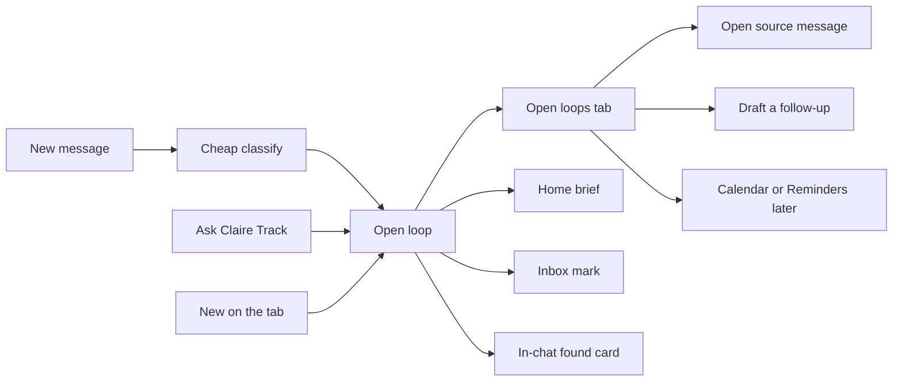

# Open loops

An **open loop** is a conversation-linked item that still needs a next move from you or from someone else. It is the product noun for the tab, Ask Claire Track, in-chat found cards, and reminder copy.

This spec is the user-facing system. Detection internals, relevance scoring, and the evaluation harness live in [How Loops work](../apps/website/src/content/docs/product/loops.tsx) and [Loops: relevance and evaluation](../apps/website/src/content/docs/build-claire/loops.tsx). Plugin export (Calendar, Reminders, Tasks) is specified in the [plugin system](../apps/website/src/content/docs/extensibility/plugin-system.tsx). Claire owns the conversation-linked open item; plugins export it.

Do **not** rename this surface to Reminders or Tasks.

## Why this name

**Open loops** already lives in Ask Claire (`Find open loops` — promises, questions, and plans). It covers:

- Things you said you would do
- Things you are waiting on
- Unanswered questions
- Unconfirmed plans
- Manual reminders you add yourself

It works for dinner with Dad and a client deck. “Close the loop with Maya” is the same sentence in both worlds. Business landing can keep “Promises become work” as marketing; the app noun is Open loops.

The `promises` table and `/promises` routes are already `loops`. Keep using those IDs. This spec is about what people see and can do.

## What is wrong today

The live tab in [`apps/client/features/loops/loops-screen.tsx`](../apps/client/features/loops/loops-screen.tsx) is a flat list with metric tiles and Open / Waiting / Done chips. It mostly shows stored commitments, even though Ask Claire already talks about questions and plans, and the detector already classifies richer kinds.

Other gaps:

- Detection runs on new messages, but the UI implies a magical full-library scan. Be honest: incremental on ingest, optional backfill, user dismiss trains it.
- `notify_loops` exists in preferences and is not honored on delivery.
- Overdue is display-only; reminders only fire in a future window.
- Mobile has no snooze, no source excerpt, and no “Not a loop.” Desktop already has snooze.
- Ask Claire **Track** and in-chat **Loop found** are still mockup-only in the lab.
- The tab home does not match Ask Claire language (no grouped Needs you / Waiting / Later, composer on a modal instead of a lime **New**).

Related visual source of truth: [`docs/DESIGN_TO_APP_SPEC.md`](DESIGN_TO_APP_SPEC.md) (Ask Claire chrome, tab bar, Loops rename).

## Definition

An open loop is a conversation-linked item that still needs a next move from you or from someone else.

It is **not**:

- An unread message
- A plugin task or reminder in Calendar / Reminders / Tasks
- Something Claire sends

A loop opens when a conversation creates an obligation, changes as the conversation changes, and closes when the conversation resolves it — as a single item, not a pile of fragments. Early negotiation stays quiet. “How about Tuesday?” is not a plan; “Tuesday at 10 works — see you then” can be.

## Five kinds

| Kind     | Meaning                                  | Example                           |
| -------- | ---------------------------------------- | --------------------------------- |
| You owe  | You committed                            | Send Maya the deck by 10          |
| Waiting  | They committed, or owe you an answer     | Noah said he would confirm Friday |
| Question | A question aimed at you is still open    | Priya: “Are we still on?”         |
| Plan     | A time/place was proposed, not confirmed | Launch September 18               |
| Remember | You added it by hand                     | Pick up the cake                  |

Personal and business use the same objects. Copy stays human: “You owe Maya the deck” and “Waiting on Noah” work in both.

## Surfaces

- **Tab** is the list of what still needs a next move.
- **Home brief** can surface the ones that need you today.
- **Inbox** can mark a conversation that has an open loop.
- **In-chat** shows one ambient **Loop found** card. Do not add a second smart-card tray.
- **Ask Claire Track** creates or focuses the same object the tab shows.

## Tab IA

Ask Claire language. Not metric tiles. No composer on the home of this tab.

- Title **Open loops**. Subtitle: “What still needs a next move.”
- Lime **New** in the header.
- Compact chips: All / You owe / Waiting / Questions / Plans
- Grouped list: **Needs you** (overdue + today + unanswered), then **Waiting**, then **Later**
- Rows reuse the Ask Claire thread-row: circle avatar, kind kicker, one-line loop, person + source, due
- Tap opens a detail sheet: excerpt, source, Done / Snooze / Not a loop / Open chat / Draft a follow-up
- Empty: “Nothing open. Claire will catch new loops as they appear.”

Tab bar label/icon can stay the existing loops mark. The screen title is **Open loops**.

## Detection policy

Make the “scan everything” idea real without lighting money on fire.

- Default: classify **new** messages only, cheap model, confidence floor before insert
- Optional one-time backfill, user-started, same as Ask Claire indexing
- Both inbound and outbound
- Dedup by similar content + same chat
- **Not a loop** dismisses and suppresses near-duplicates
- Honor a per-chat tracking / sensitivity toggle (see product loops docs)
- Do not extract from every historical message on every launch

Relevance stays deterministic code, not a prompt: a missed loop beats a wrong one; group noise is someone else’s business until a hard pass (1:1, or you committed yourself).

## Actions

- **Done** / reopen
- **Snooze** until tomorrow 9:00 or a picked time (mobile must gain this; desktop already has it)
- **Open** the source message
- **Draft a follow-up** (drops text in the composer; Claire still does not send)
- **Track** from Ask Claire (creates or focuses the loop)
- **Not a loop** (dismiss + suppress)
- Phase 2: Add to Calendar / Reminders via plugins

## Reminders

- Honor `notify_loops`
- Nudge before a deadline and once when it becomes overdue
- Different copy for You owe vs Waiting
- Quiet hours apply
- Per-chat mute applies (Claire-local; every device)
- Past-due items stay visible in Needs you even if the reminder already fired

Overdue is derived, never stored: live status (`open` / `waiting` / `snoozed`) and `COALESCE(snoozed_until, deadline) < now()`.

## What we will not do

- Auto-send a follow-up
- Turn every unread into a loop
- Replace the Reminders or Tasks plugins
- Show a second smart-card tray in chat (one ambient **Loop found** card is enough)
- Silently rescan the full library on every launch

## Ask Claire thread chrome

While chatting, no tab bar. Home keeps the tab bar. The moment you are in New or an active Claire thread — anywhere the composer is on screen — hide the bar (lab: `.screen.no-tab`). Same rule for Open loops → Ask Claire thread screens.

No sparkles in the input. The composer is text + send. Sparkles already live on the tab and in Claire’s answer cards.

A **+** menu replaces a decorative leading icon. Options:

- **Tag a person** — same as `@`; adds a focus chip
- **Filter by platform** — WhatsApp / Telegram / Instagram / all connected
- **Focus a chat** — scope this thread to one conversation, not just a person
- **Find open loops** — run the loops prompt in this thread
- **Check the tone** — same, as a thread action
- **Clear this conversation** — wipe turns, keep the thread; destructive, confirm
- **Delete thread** — remove it from Recent

Do not put Send, Use reply, or plugin exports in this menu. Those stay on the answer cards.

## Lab mockups (after this spec)

Spec first. Then extend the gallery; no app code in that pass.

- Extend `landing/ask-claire-mockups.html` with a **Loops** filter and an Open loops section
- Update Ask Claire screen 05: Track lands in **Open loops**, not Promises
- Replace `landing/app-mockups.html` screen 05 (Promises) with the Open loops home

Screens to draw: tab home, You owe, Waiting, loop detail, new loop, in-chat Loop found, Ask Claire Track, all clear, Claire chat + menu.

Decision cards on the gallery: a loop is a next move; Claire never sends; detect on ingest not a silent full-library rescan; Not a loop is a first-class action; plugins are export, not the list.

## Launch sequence

After mockups, not in the spec pass:

1. Rename the tab and copy to **Open loops**. Keep the `loops` API.
2. Grouped list + kinds + detail sheet + snooze + Not a loop.
3. Wire Ask Claire Track and in-chat Loop found.
4. Add question + plan extraction behind the same confidence floor.
5. Honor `notify_loops`; fix overdue + badge.
6. Later: backfill, plugins, remaining copy that still says Promise.
