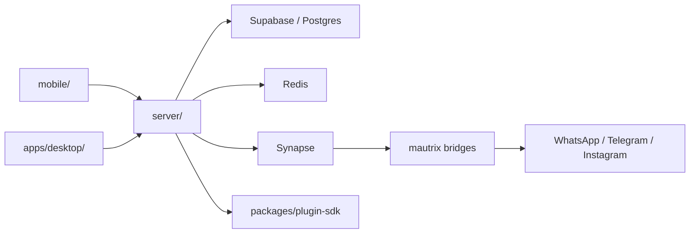

# Architecture overview

Claire is a unified messenger. The mobile and desktop clients talk to a Bun API. In `PLATFORM_MODE=matrix`, the API talks to Synapse and mautrix bridges. Messages are stored in Postgres through Supabase.

Mock mode bypasses live bridges so contributors can work without messaging accounts.

Durable details live in:

- [docs/MATRIX_BRIDGE_REFERENCE.md](../MATRIX_BRIDGE_REFERENCE.md)
- [docs/MOCK_BRIDGE.md](../MOCK_BRIDGE.md)
- [docs/PLATFORM_MODE.md](../PLATFORM_MODE.md)
- [docs/SECURITY_CLAIMS_AND_ROADMAP.md](../SECURITY_CLAIMS_AND_ROADMAP.md)
